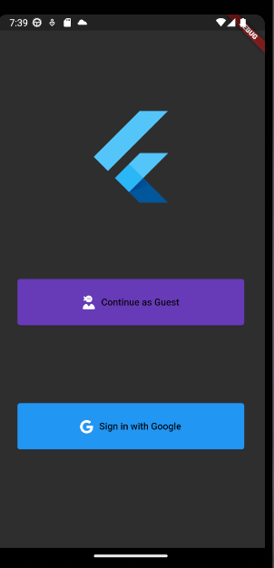
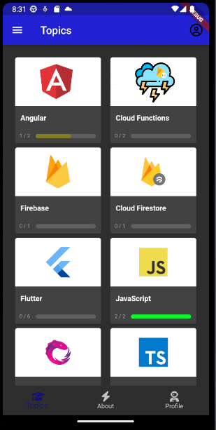
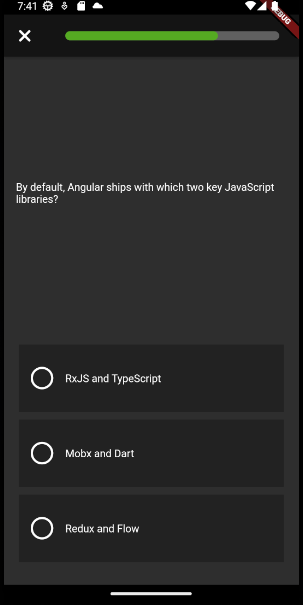
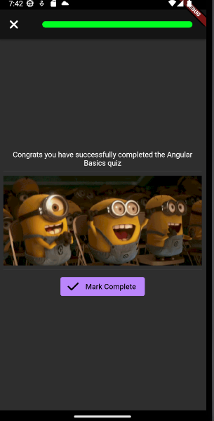
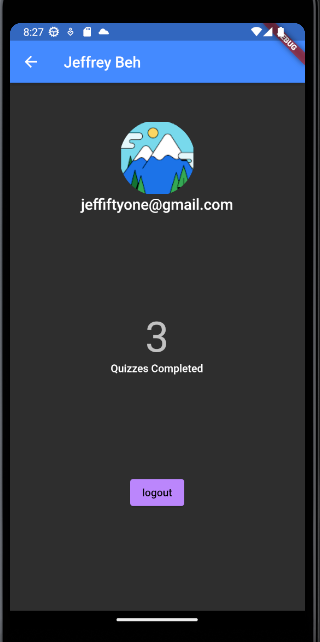
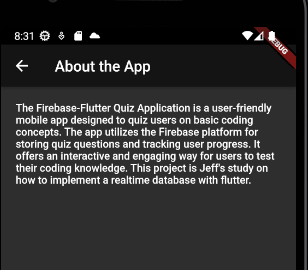

# Coding Quiz App

## Description
The Firebase-Flutter Quiz Application is a user-friendly mobile app designed to quiz users on basic coding concepts. The app utilizes the Firebase platform for storing quiz questions and tracking user progress. 

## Table of Contents

* [Demo](#Demo)
* [Screenshots](#screenshots)
* [License](#license)
* [Questions](#questions)

## Demo
https://drive.google.com/file/d/1J__aHvICYhHTrjCBsgFbdgWA5YnK5qCX/view

## Screenshots

## License
This project is licensed under the MIT license.

## Questions
If you have any queations regarding the repo, open an issue or contact me directly at [jeffiftyone@gmail.com](mailto:jeffiftyone@gmail.com).
You can find more of my work at [Jeffiftyone](https://github.com/Jeffiftyone)